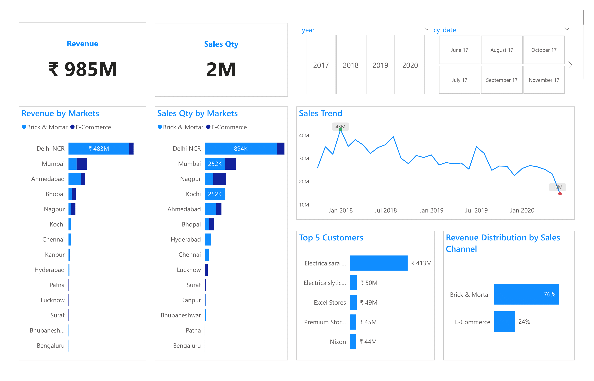
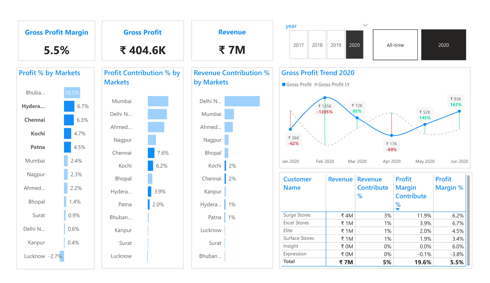

# Background And Overview
AtliQ Hardware is a company which supplies Computer Hardware & Peripherals Manufacture to the clients across India. Its clientele includes both Brick-and-Mortar retailers and E-commerce platforms.

The Sales Director at AtliQ Hardware's headquarters seeks to track sales performance in a dynamic market and gain valuable insights into business operations to inform decisions that drive sales growth. 

To achieve this, it is essential for the company to build a well-structured and intuitive dashboard that provides both a high-level overview and in-depth analysis of key metrics relevant to the sales department.

This dashboard provides insights and recommendations in the following key areas: 
- **Key Insight**: Evaluation of historical sales patterns, assessment of revenue and sales volume in the market, and identification of the top 5 customers and products
- **Profit Analyst**: Analyze historical patterns of Gross Profit trends, focusing on the following indicators: Gross Profit, Gross Profit Margin, Gross Profit Contribution %, and Revenue Contribution % in relation to the market and customers
- **Performance Insight**: Evaluate the performance of Gross Profit Targets across zones, markets, customers, and products

An interactive PowerBI dashboard can be downloaded [here](https://github.com/nhatnhm/Sales-Performance-Insights-for-India-Computer-Hardware/tree/main/Visualization)

This SQL queries utilized to clean, organized, and prepare data for dashboard can be found [here](https://github.com/nhatnhm/Sales-Performance-Insights-for-India-Computer-Hardware/tree/main/Data%20cleaning)
# Data Structure & Initial Checks
AtliQ's database structure as seen below consists of five tables: customers, date, markets, products, transactions with a total row count of 149,855 records

# Executive Summary
## Key Insight
**Company Revenue Analysis for the Period 2017–2020**
- The company achieved total revenue of **985 million INR** and sold **2 million products** between 2017 and 2020. However, revenue declined sharply after peaking at **43 million INR** in 2018, dropping to **15 million INR** by 2020 (a **65% decrease**).
  
**Market Analysis**
- **Delhi NCR** emerged as the dominant market, contributing **483 million INR** (**42% of total revenue**) and **894 thousand units sold** (**37% of total sales volume**).
- Mumbai, Ahmedabad, Nagpur, and Kochi had lower contributions, reflecting an intense geographical concentration.

**Key Customers & Distribution Channels**
- **Electricalsara Store** was the largest customer, contributing **413 million INR** (**42% of total revenue**), highlighting a high dependency risk on a single partner.
- Traditional retail channels dominated with **76%** of revenue, **3.2 times higher** than **e-commerce** (24%).

## Market Segmentation
### Underutilized Profit Markets
- In 2020, the four markets of **Hyderabad**, **Chennai**, **Kochi**, and **Patna** achieved **gross profit margins** of **6.7%**, **6.3%**, **4.7%**, and **4.5%**, respectively. Although they accounted for only about **5%** of **total revenue,** these markets **contributed** nearly **20%** of **total gross profit**.
- This disproportionate profit performance relative to their revenue share indicates **lower operating costs**, **higher value-added offerings**, or **more favorable pricing** in these regions. These markets can be seen as “**Underutilized Profit**” with significant earnings potential, suggesting the company should consider further investments or tailored strategies to tap into their potential fully.

### Low-Margin Markets 
- The three key markets **Delhi** **NCR**, **Mumbai**, and **Ahmedabad**, account for **82%** of **revenue** and contribute **65.1%** of **profit**, yet their average profit margin is only **1.2%**. In particular, **Delhi NCR** remains the company’s **core market—consistently** delivering around **50%** of **both** **revenue** and **profit** from 2017 to 2019—but its **profit margin fell** to just **0.6%** in the **first half of 2020**, sharply dragging down overall revenue and profit.
- **Mumbai** and **Ahmedabad** also rank among the **top** **revenue** drivers, they suffer from **persistently** **low** **profit** margins with little improvement over the past three years. Therefore, it is crucial to focus on boosting profitability in these two markets to optimize total revenue.
  

## Recommendation
- Revenue is currently heavily reliant on the **Delhi NCR market**, particularly on **Electricalsara Stores**, making sales highly susceptible to volatility. To mitigate this risk, it is essential to diversify the sales network by targeting a broader customer base and **expanding into additional markets**. Simultaneously, efforts should be made to further **develop e-commerce channels**, which currently contribute only a small share of the total revenue
- In high **Gross Profit** markets like **Bhubaneshwar, Hyderabad, and Chennai** with limited customers, businesses should focus on increasing revenue by maximizing value from existing customers through **up-sell**, **cross-sell**, and tailored incentives. Expanding the customer network can be achieved by encouraging referrals from current retailers with **commission-based rewards**. Additionally, enhance **brand awareness** through B2B marketing strategies such as hosting **workshops** and participating in **trade exhibitions** to build credibility and attract new retailers
- **Electricalsara Store** is the largest revenue-generating customer, operating in three markets: **Mumbai, Bhopal, and Delhi NCR**. However, 99% of its revenue comes from the **Delhi NCR** market, where the **Profit Margin** is low. Therefore, it is necessary to focus on **cost optimization** in areas such as **logistics**, as well as consider **increasing prices** or **offering additional complementary products** to improve profitability
- The **Kanpur** market generates a **Gross Profit** of 0.4%, however, the **Zone** and **Control** customers in this market have negative profit margins of **-18.6%** and **-22.2%** respectively. Therefore, it is necessary to identify the cost factors impacting profitability or consider **discontinuing** these customers to optimize business performance
