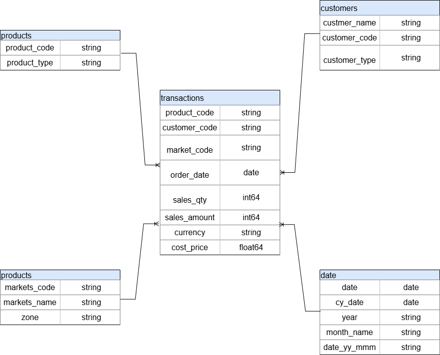
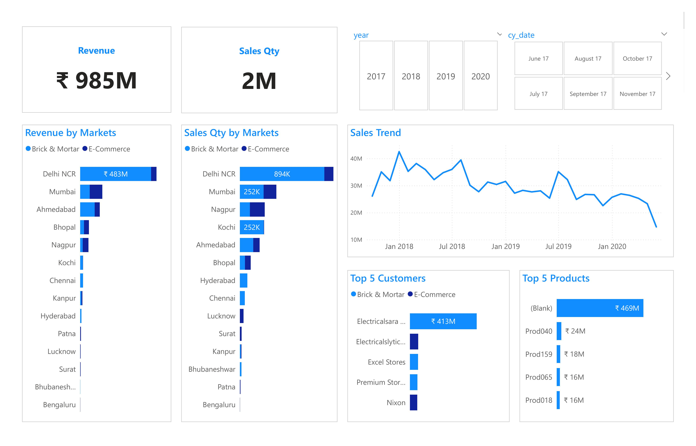
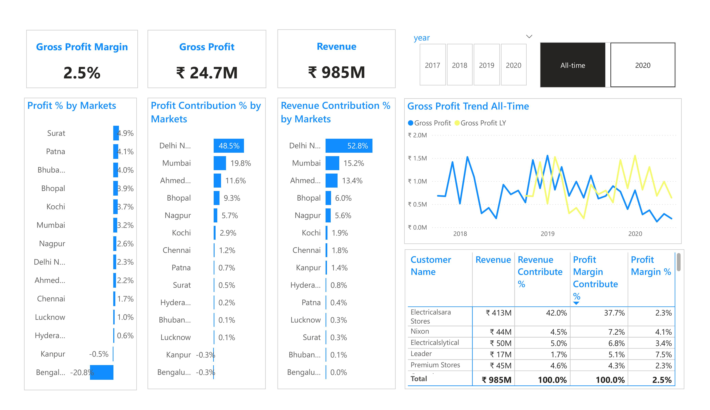
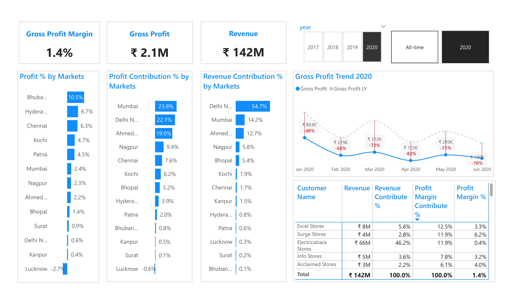
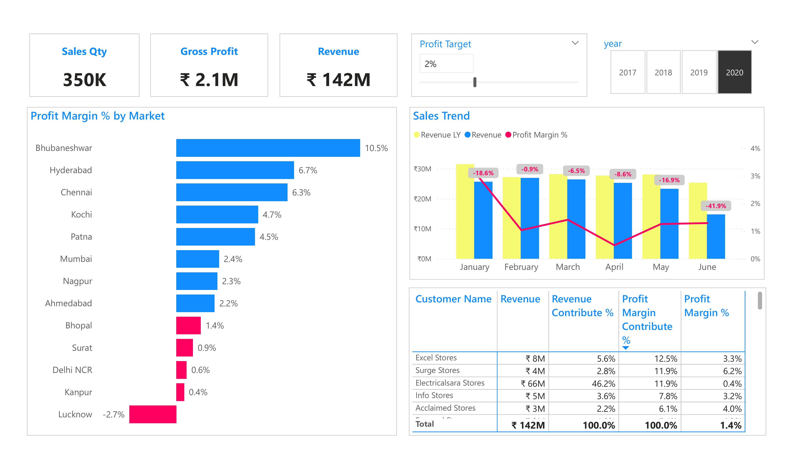

# Background And Overview
AtliQ Hardware is a company which supplies Computer Hardware & Peripherals Manufacture to the clients across India. Its clientele includes both Brick-and-Mortar retailers and E-commerce platforms.

The Sales Director at AtliQ Hardware's headquarters seeks to track sales performance in a dynamic market and gain valuable insights into business operations to inform decisions that drive sales growth. 

To achieve this, it is essential for the company to build a well-structured and intuitive dashboard that provides both a high-level overview and in-depth analysis of key metrics relevant to the sales department.

This dashboard provides insights and recommendations in the following key areas: 
- **Key Insight**: Evaluation of historical sales patterns, assessment of revenue and sales volume in the market, and identification of the top 5 customers and products
- **Profit Analyst**: Analyze historical patterns of Gross Profit trends, focusing on the following indicators: Gross Profit, Gross Profit Margin, Gross Profit Contribution %, and Revenue Contribution % in relation to the market and customers
- **Performance Insight**: Evaluate the performance of Gross Profit Targets across zones, markets, customers, and products

An interactive PowerBI dashboard can be downloaded [here](https://github.com/nhatnhm/Sales-Performance-Insights-for-India-Computer-Hardware/tree/main/Visualization)

This SQL queries utilized to clean, organized, and prepare data for dashboard can be found [here](https://github.com/nhatnhm/Sales-Performance-Insights-for-India-Computer-Hardware/tree/main/Data%20cleaning)
# Data Structure & Initial Checks
AtliQ's database structure as seen below consists of five tables: customers, date, markets, products, transactions with a total row count of 149,855 records

# Executive Summary
## Key Insight
**Company Revenue Analysis for the Period 2017–2020**
- The company achieved total revenue of **985 million INR** and sold **2 million products** between 2017 and 2020. However, revenue declined sharply after peaking at **43 million INR** in 2018, dropping to **15 million INR** by 2020 (a **65% decrease**).
  
**Market Analysis**
- **Delhi NCR** emerged as the dominant market, contributing **483 million INR** (**42% of total revenue**) and **894 thousand units sold** (**37% of total sales volume**).
- Mumbai, Ahmedabad, Nagpur, and Kochi had lower contributions, reflecting an intense geographical concentration.

**Key Customers & Distribution Channels**
- **Electricalsara Store** was the largest customer, contributing **413 million INR** (**42% of total revenue**), highlighting a high dependency risk on a single partner.
- Traditional retail channels dominated with **76%** of revenue, **3.2 times higher** than **e-commerce** (24%).

## Profit Analyst 
### All Time
- The **Gross Profit Margin**, **Gross Profit**, and **Revenue All-time** are **2.5%**, **₹24.7M**, and **₹985M**, respectively. The **Profit %** across markets is relatively consistent, ranging from **5% and below**. However, it is worth noting that the **Bengaluru market** has a negative **Profit %** of **-20.9%**
- The **Delhi NCR market** leads in **Profit Contribution %**, accounting for **48.5%**. The four largest markets, namely **Delhi NCR, Mumbai, Ahmedabad, and Bhopal**, contribute **89%** of the total market's **Profit Contribution %**. Similarly, in **Revenue Contribution %**, the **Delhi NCR market** holds the largest share at **52.8%**, while the four largest markets collectively contribute **87%** of the total **Revenue Contribution %**
- The **Gross Profit Trend** remained stable in **2018** and **2019**, although there was a significant drop in mid-2018, followed by a recovery to levels close to those of 2019. In **2020**, the **Gross Profit Trend** decreased significantly compared to the same period in the previous year
- **Electricalsara Stores** contributed the largest proportion, accounting for **42% of total revenue**, and also made up **37.7% of Profit Margin Contribution %**, significantly surpassing all other customers

### 2020
- The **Gross Profit Margin** stood at only **1.4%**, reflecting a very low profitability relative to revenue. Total **Revenue** amounted to **₹142M**, whereas **Gross Profit** was just **₹2.1M**, indicating that direct costs consumed the majority of the revenue
- The **Bhubaneshwar market** has the highest **Profit %** (**10.5%**), demonstrating strong performance compared to other markets. On the other hand, the **Lucknow market** has negative returns (**-2.7%**), which requires careful consideration in terms of trading strategy and cost management
- The three largest markets (**Mumbai**, **Delhi NCR**, and **Ahmedabad**) accounted for **65%** of total **Profit Contribute %**. The remaining markets contributed less than **10%**, with the lowest negative contribution coming from **Lucknow** (**-0.6%**)
- **Delhi NCR** leads the way, accounting for **54.7%** of total revenue. **Mumbai** (**14.2%**) and **Ahmedabad** (**12.7%**) are the next highest revenue markets. The remaining markets contribute less than **6%**, with **Bhubaneshwar** accounting for the lowest at **0.1%**
- **Gross Profit** has decreased sharply month by month compared to the same period last year. The sharpest decrease was in **April 2020** (**-82%**). Other months saw a decline from **-48%** (January) to **-70%** (June), indicating a prolonged downward trend
- The three largest customers in terms of **Revenue Contribute % ** and **Profit Margin Contribute %** are **Electricalsara Stores**, **Excel Stores**, and **Surge Stores**. **Electricalsara Stores** accounts for **46.2%** of revenue but has a profit margin of only **0.4%**. **Excel Stores** and **Surge Stores** have better profit margins of **3.3%** and **6.2%** respectively, despite their smaller revenue contributions (**5.6%** and **2.8%**).

## Performance Insight
- Sales Quantity: **350K units**. Gross Profit: **₹2.1M**. Revenue: **₹142M**. Average Profit Margin: **1.4%**, which is below the Profit Target of **2%**
- Best-performing markets: **Bhubaneswar** with a profit margin of **10.5%** (highest), followed by **Hyderabad** at **6.7%** and **Chennai** at **6.3%**. Markets that underperformed the profit target: **Bhopal** at **1.4%**, **Surat** at **0.9%**, **Delhi NCR** at **0.6%**, **Kanpur** at **0.4%**, and **Lucknow** at **-2.7%** (lowest, incurring a loss)
- Revenues have steadily declined in 2020 compared to the same period last year, with a decrease of **-18.6% in January** and a record drop of **-41.9% in June**. The **Profit Margin** has also shown a consistent downward trend, dropping from approximately **3.1% in January** to **~1.3% in June**, with the lowest point recorded in **April** at a Profit Margin of **0.5%**.

## Recommendation
- Revenue is currently heavily reliant on the **Delhi NCR market**, particularly on **Electricalsara Stores**, making sales highly susceptible to volatility. To mitigate this risk, it is essential to diversify the sales network by targeting a broader customer base and **expanding into additional markets**. Simultaneously, efforts should be made to further **develop e-commerce channels**, which currently contribute only a small share of the total revenue
- In high **Gross Profit** markets like **Bhubaneshwar, Hyderabad, and Chennai** with limited customers, businesses should focus on increasing revenue by maximizing value from existing customers through **up-sell**, **cross-sell**, and tailored incentives. Expanding the customer network can be achieved by encouraging referrals from current retailers with **commission-based rewards**. Additionally, enhance **brand awareness** through B2B marketing strategies such as hosting **workshops** and participating in **trade exhibitions** to build credibility and attract new retailers
- **Electricalsara Store** is the largest revenue-generating customer, operating in three markets: **Mumbai, Bhopal, and Delhi NCR**. However, 99% of its revenue comes from the **Delhi NCR** market, where the **Profit Margin** is low. Therefore, it is necessary to focus on **cost optimization** in areas such as **logistics**, as well as consider **increasing prices** or **offering additional complementary products** to improve profitability
- The **Kanpur** market generates a **Gross Profit** of 0.4%, however, the **Zone** and **Control** customers in this market have negative profit margins of **-18.6%** and **-22.2%** respectively. Therefore, it is necessary to identify the cost factors impacting profitability or consider **discontinuing** these customers to optimize business performance
